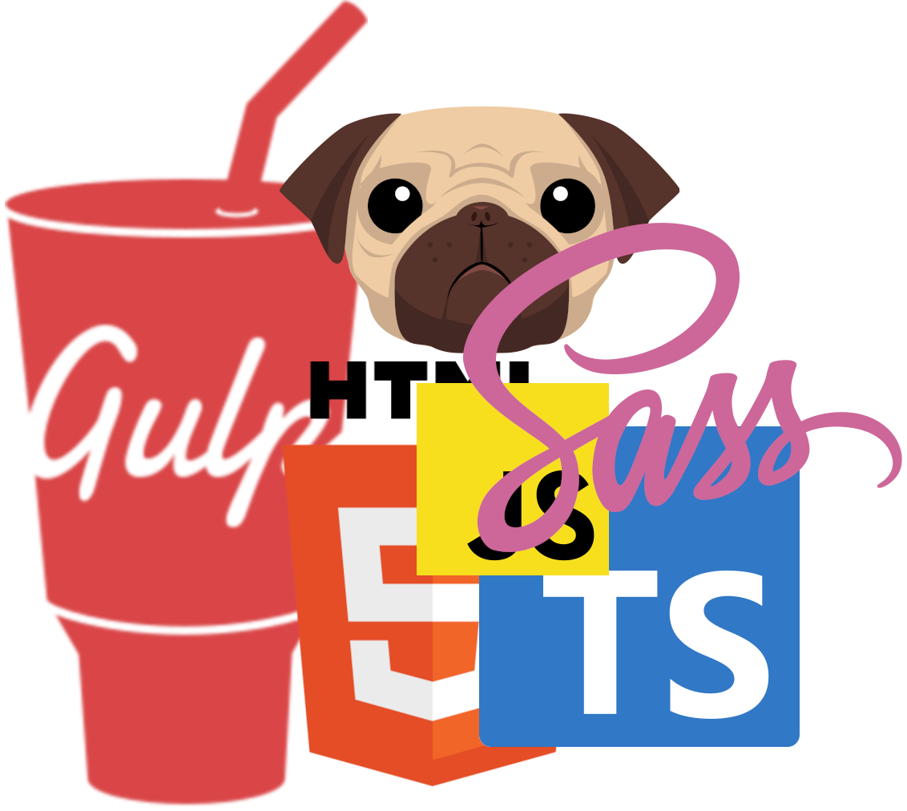

<div style="display: flex; align-items: flex-start;">
  <div style="flex: 1;">
    <h1>Web Learning Kit Generator</h1>
    <p>Web Learning Kit Generator is a tool designed for beginners who want to build static websites with minimal configuration. The application creates a Gulp build process dynamically based on the user's choice of markup language(HTML/Pug), stylesheet language(SASS/SCSS), and scripting language(Javascript/Typescript). It's an easy and fast way to get started with a more realistic development environment on your local machine, beyond online IDEs</p>

    This project is based on a simple and fast workflow focused mainly on the front-end task. It gives a solid starting point for newcomers who wants a ready-to-deploy local environment setup. The sources used to build this project includes:
  </div>
  <div style="flex: 0 0 300px; margin-left: 20px;">
    
  </div>
</div>

  * [H5BP Project](https://github.com/h5bp/html5-boilerplate)
  * [React Redux Starter Kit](https://github.com/davezuko/react-redux-starter-kit)
  * [Mark Goodyear's Blog](https://markgoodyear.com/2014/01/getting-started-with-gulp/)
  * [Web Starter Kit](https://github.com/google/web-starter-kit)

## Features

  * Dynamic Configuration: Choose your preferred markup (**Pug/HTML**), stylesheet (**Sass/SCSS/CSS**), and script (**JavaScript/TypeScript**) languages, and the tool will generate a customized Gulpfile for you.
  
  * Beginner-Friendly: Ideal for those new to web development who want to experiment with real-world tools and workflows.
  
  * Extensible: Start simple, and gradually explore more advanced features as you become comfortable.
  
  * Minimal Setup: Get up and running quickly without the need for complex configuration.
  
  * Realistic Environment: Experience coding outside of online IDEs, and start using Git or other tools as you grow your skills.

  * Bonus: you can add **Josh Comeau** css reset and **Necolas** css normalize

## Prerequisites

Before you begin, ensure you have the following installed on your system:

* Node.js (v14 or later)
* **npm** (comes with Node.js) or **Yarn**

## Getting Started

After [Node.js](https://nodejs.org/en/download/), [npm](https://docs.npmjs.com/getting-started/installing-node), [Gulp](https://github.com/gulpjs/gulp/blob/master/docs/getting-started.md) and [Bower](https://bower.io/#install-bower)(optional) installation, you can create a new project based on `pug-sass-boilerplate-starter-kit` by doing the following:

## Installation

### 1 - Clone or download this repository

### 2 - Install dependencies:

Using npm:
```bash
npm install
```

Or using Yarn:
```bash
yarn install
```

## Usage

### Development

To start the development server with live reloading:

```bash
gulp
```

This will run the `gulp` command, which starts a local server and watches for file changes.

### Production Build

To create a production-ready build:

```bash
npm run build
```
or
```bash
yarn build
```

This will generate optimized files in the `dist` directory.

### Running Your Local Server With Gulp

This task will open the browser window usually with the URL http://localhost:3000/. Any saved changes made to the project files, will reflect automatically over the browser.

## Project Structure

```
.
├── src/                # ** Your code folder! **
│   ├── img/            # Image files
│   ├── js/             # JS/TS files
│   ├── styles/         # Sass/SCSS files
│   └── templates/      # Pug/HTML files
│   
├── _gulp/              # Gulp configuration and tasks
├── dist/               # Production build output
├── gulpfile.js         # Gulp entry point
├── package.json        # Project dependencies and scripts
└── README.md           # Project documentation
```
The src/ directory is created after the Yarn or npm install, **this is where your code journey begins**. The dist/ and build/ folders can be used to host your web project in a simple and convenient way. there are a lot of options to host it, including **Github Pages**

## Contributing

Contributions are welcome! Please feel free to submit a Pull Request.

## License

This project is open source and available under the [MIT License](LICENSE).

---

For more detailed information about the gulp tasks and project configuration, please refer to the comments in the `gulpfile.js` and the files in the `_gulp` directory.